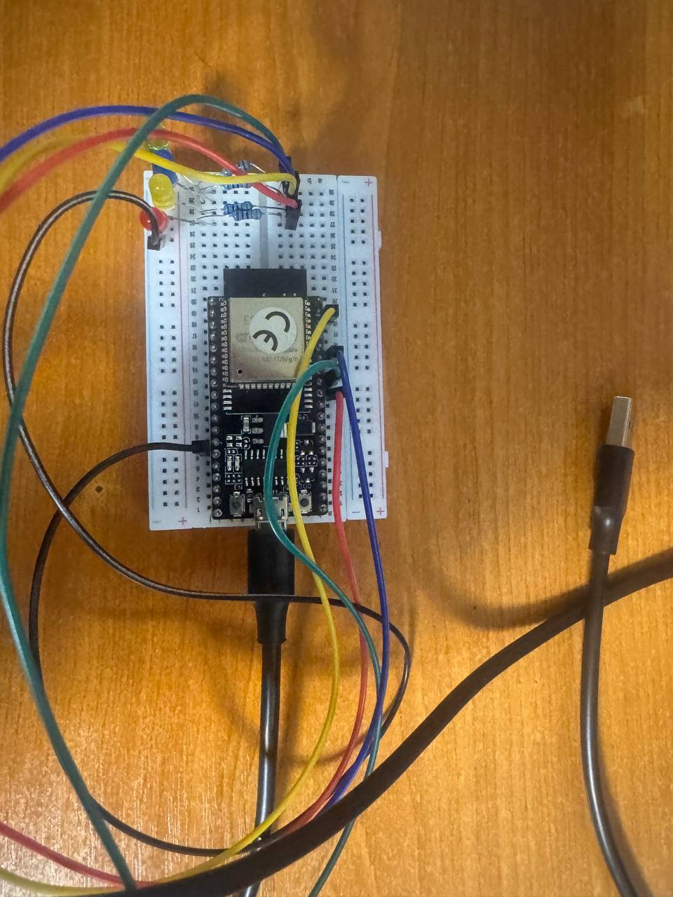

# ESP32 Remote LED Control

A beginner IoT project for remotely controlling four physical LEDs connected to an ESP32 over the Internet.



## What the project does

A browser changes LED states on a small Flask web server. The ESP32 connects to Wi-Fi and polls the server over HTTPS approximately once per second. The server returns four values such as `1,0,1,0`, and the ESP32 converts them into GPIO HIGH/LOW states.

```text
Phone / PC
    |
    | HTTPS
    v
ngrok public URL
    |
    v
Flask server
    ^
    | HTTPS GET /status
    |
ESP32 -> GPIO -> LEDs
```

ngrok is used to expose the local Flask server to the Internet, allowing the ESP32 and controlling browser to be on different networks.

## Hardware

- ESP32-WROOM-32E development board
- Red, green, blue and yellow LEDs
- 4 × 330 Ω resistors
- Breadboard and jumper wires
- USB cable or power bank

| LED | GPIO |
| --- | ---: |
| Red | 18 |
| Green | 19 |
| Blue | 21 |
| Yellow | 23 |

## Pinout


ESP32-WROOM-32E documentation and pin descriptions:

https://documentation.espressif.com/esp32-wroom-32e_esp32-wroom-32ue_datasheet_en.html

## Repository structure

```text
ArduinoIDE/
  ESP32_Remote_LED_Control/
    ESP32_Remote_LED_Control.ino

VisualStudioCode/
  ESP32_Remote_LED_Control/
    src/
      main.cpp
    platformio.ini

Server/
  app.py
  templates/
    index.html

Photos/
  PhotoOfProject.jpg
  ESP32 WROOM 32E PinOut.png
```

The Arduino IDE and Visual Studio Code versions use the same Arduino framework and the same ESP32 logic. The Visual Studio Code version is configured for PlatformIO.

## Configuration

No personal Wi-Fi credentials or private server addresses are stored in this repository. The firmware contains placeholders:

```cpp
const char* SSID = "YOUR_WIFI_NAME";
const char* PASSWORD = "YOUR_WIFI_PASSWORD";

const char* SERVER_URL =
  "https://YOUR-NGROK-DOMAIN.ngrok-free.dev/status";
```

Replace these locally before uploading the firmware. Do not commit your real Wi-Fi password.

## Arduino IDE

Install `esp32 by Espressif Systems`, select `ESP32 Dev Module`, open the sketch from the `ArduinoIDE` folder, enter your local configuration, select the correct COM port and upload it.

## Visual Studio Code

Install Visual Studio Code and PlatformIO, open `VisualStudioCode/ESP32_Remote_LED_Control`, enter your local Wi-Fi and ngrok values in `src/main.cpp`, then build and upload using PlatformIO.

## Flask server and ngrok

Install Flask:

```powershell
pip install flask
```

Start the local server:

```powershell
python Server/app.py
```

It listens on port 5000. In another terminal expose it with ngrok:

```powershell
ngrok http 5000
```

ngrok will display a public HTTPS address. Put that address plus `/status` into `SERVER_URL` in your local ESP32 firmware.

Example only:

```cpp
const char* SERVER_URL =
  "https://example.ngrok-free.dev/status";
```

The real ngrok domain is intentionally not committed to the repository.

## Server API

- `/` — web control page
- `/toggle/<color>` — toggles one LED
- `/status` — returns all LED states
- `/status/<color>` — returns one LED state

The order returned by `/status` is red, green, blue, yellow.

## Security note

`client.setInsecure()` disables TLS certificate verification. It is convenient for this learning prototype but should be replaced with proper certificate validation in a production system.

## License

MIT License.
